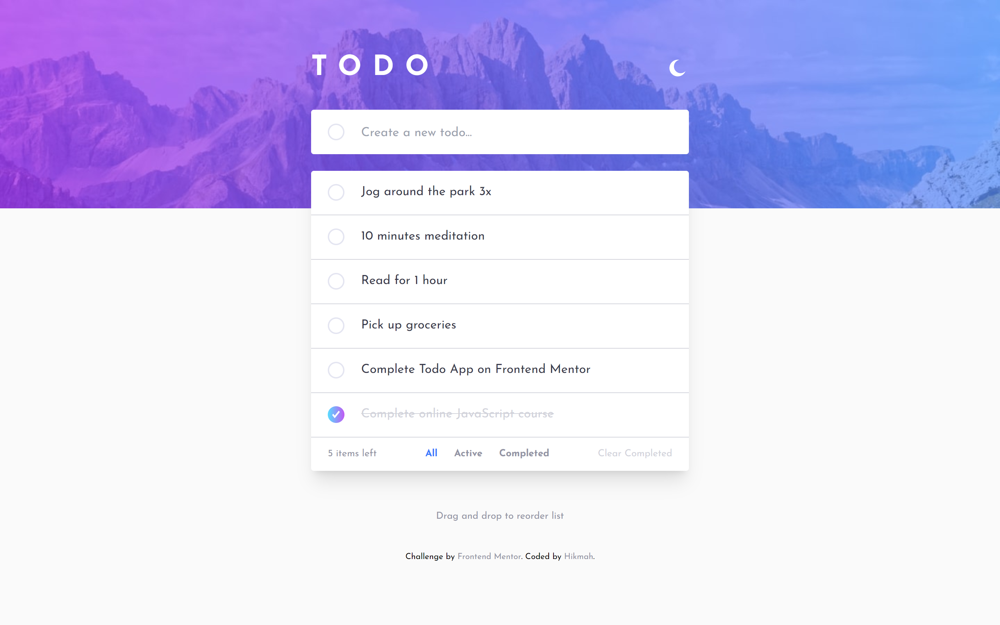

# Frontend Mentor - Todo app solution

This is a solution to the [Todo app challenge on Frontend Mentor](https://www.frontendmentor.io/challenges/todo-app-Su1_KokOW). Frontend Mentor challenges help you improve your coding skills by building realistic projects. 

## Table of contents

- [Overview](#overview)
  - [The challenge](#the-challenge)
  - [Screenshot](#screenshot)
  - [Links](#links)
  - [Built with](#built-with)
  - [My process](#my-process)
- [Author](#author)

## Overview

### The challenge

Users should be able to:

- View the optimal layout for the app depending on their device's screen size
- See hover states for all interactive elements on the page
- Add new todos to the list
- Mark todos as complete
- Update old todos
- Delete todos from the list
- Filter by all/active/complete todos
- Clear all completed todos
- Toggle light and dark mode
- Drag and drop to reorder items on the list


### Screenshot



This is the screenshot of my solution

### Links

- Solution URL: [Add solution URL here](https://www.frontendmentor.io/solutions/todo-app-react-django-B86ogFKWc)
- Live Django URL: [Add live site URL here](https://todo-react-django-app.herokuapp.com/)

### Built with

- Semantic HTML5 markup
- CSS custom properties
- Flexbox
- CSS Grid
- Mobile-first workflow
- Axios
- [React](https://reactjs.org/) - JS library
- [Tailwindcss](https://tailwindcss.com/) - CSS framework
- [JSON Server](https://www.npmjs.com/package/json-server) - full fake REST API 


### My process
- After finishing the UI section of the project, I added functionality to the form. Before that, I implemented a complete state on the todo item clicked (the checkbox icon at the left), using the **checked** state to toggle between the true and false. 

- Next, the `input` field was manipulated by using the **input** state which empties *onsubmit*( on the condition that there is something input). At first, when I did this, I had to use `setTodos([...todos, input])` to add each input into the todos array which I then mapped in **Todo.jsx** to each todo item. 

- When the todos are displayed nicely in the UI, I installed JSON server to enable a fake REST API, creating a **db.json** which was watched by the server and allowing the todo to persist after reloading. Initially, I added a list of todos in the JSON file and allowed it to display, consisting of a todo, an id, and a complete. After that, `GET` the data and setTodos. I used `useEffect` to display the latest todo after the component mounts.
I enabled the error in case there is one.

- In my `submitTodo()`, I updated it to allow it to
`POST` an input into the server and update todos. Then I enabled the delete, then update. For the update, firstly I created a function that gets the id and text from the todo item, adds them to a state, and input them in the form. I then update my submitTodo to check if it's a new todo (no id yet: 
`if(id===''){...}`) ie  the former `submit` code was wrapped in this conditional and the 'else' is for the `PUT` request, for updating the clicked todo.

- I had some issues like the page reloads whenever a `POST` or `PUT` request is made. So I installed **axios**. I remove the async await when using axios

- In the updated code:
> Create todo: `setTodos([...todos, reponse.data])`

> Update todo: `setTodos(todos.map(todo=>(todo.id==id? {id, todo:input} : todo)))` (after setting the state of the id and the input)

> Delete todo: `setTodos(todos.filter((item)=> item !== todos[id-1]))`

- In `updateTodo()`, I modified it so it adds a cancel/cross btn in the form. Only one of such btns appears in the form because a listener was added to it which set the form from `PUT` to `POST`, clearing the **id** and **input** fields and removing the cancel btn after it's clicked. I also removed the cancel btn and the id when the `PUT` request is fulfilled so that the input now submits to `POST` again.

- The delete request was having some issues, so
instead of the initial code, in the then(), I simply returned the `getData()`. I had to wrap the form-cancel btn remove in a conditional so the `<input>` field doesn't mistakenly remove on the delete request.

- For the `checkbox()`, I updated it to a `PUT` request which changes the state of the 'completed'  entry 'checked' to true or false.

- In the items remaining, I was a bit stuck. I use the function "totalTodo " and created a state "total". In the totalTodo, I set a counter and setTotal to the todos' length. I looped through the todos and checked if they were true or false. If true, I increment and vice versa. I then set Total to todos'length minus the counter and divided them by 2, ie 
:
```js    
setTotal((todos.length-counter)/2)
```

this function runs when the components first mount and every time there is a change in the todos array(I had this to the Todo.jsx to not create new errors in the App.js
The value of the total was appended into the UI, changing when items are added or removed or when checked.

- clearCompleted(): first, I added a click event on the clearCompleted div which is the same name as the function. Next after passing up the props, I created the function in App.js and looped through the todos, searching for if any of them are completed, if they are, each of them will be deleted using:  axios.delete(`http://localhost:3000/todos/${id}`)

- displayCompleted, -Active, -All: I created another state called **filterTodos** which is very useful. The reason I didn't use setTodos is bcos I didn't want the data to be lost when filtering. The setfilterTodos state will stand in place of the todos (code changed for it to replace todo) when mapping to a function.  the filterTodos gotten from the todos serves as a placeholder, as a rep of todos. 
the filterTodos changes back to the current todos whennever there is a change in todos. This is enabled in the Todos.jsx useEffect:  
```js
useEffect(() => {
    totalTodo()
    // eslint-disable-next-line
    setfilterTodos(todos)
    // eslint-disable-next-line
  }, [todos])
  ```
Onload, it returns all todos. Any change in todos causes it to return all todos

- dragItems(): this is a collection of functions for drag and drop. To initial it, I add a **dragStart** to the todoItem and initiated it in todo.jsx.  I looped through the list and added 5 drag and drop event listeners. A bit of problem with the drop causing it to missteps when dragged upwards but none when dragged downwards. It is because of the code:
- ```js
itemTwo.insertAdjacentElement("afterend", itemOne) 
```
this tells the program to only insert the li after the li in the drop site. I don't know how to correct this slight error
error handling: I had .catch() for any error in the rest API request, modified the errMessage display by transferring the code to the todo instead of todoitem.jsx bcos I don't want it to be in the ul when there is an error. Also bcos it causes multiple error messages.

Finally, I refactored everything from state to contextAPI.


## Author

- Github - [Hikmah Yousuph](https://github.com/Hikmahx)
- Frontend Mentor - [@Hikmahx](https://www.frontendmentor.io/profile/Hikmahx)
- Email - [hikmayousuph@gmail.com](hikmayousuph@gmail.com)
- LinkedIn - [Hikmah Yousuph](linkedin.com/in/hikmah-yousuph-449467204/)
